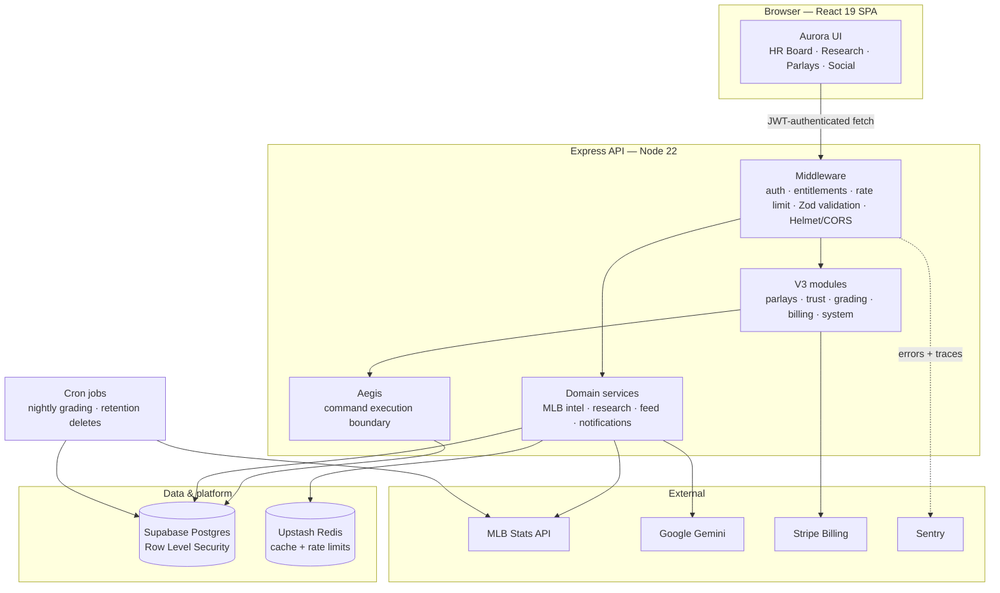

<div align="center">

# VouchEdge

**Know the next home run. Before everyone else.**

Sports research, home-run intelligence, and verified parlay tracking for MLB.
Research before the first pitch — with the evidence behind every score.

[**Live site → vouchedge.xyz**](https://www.vouchedge.xyz)


</div>

---

## What this is

VouchEdge is a sports research platform built around one uncomfortable question:
**can you actually trust the pick you're looking at?**

Most betting content is confident and unaccountable. VouchEdge is built the other
way around — every number on the screen is traceable back to official MLB data, every
posted pick is graded automatically after the game ends, and a user's track record is
computed from what actually happened rather than what they claimed.

Three things the site does:

| | |
|---|---|
| **🏟️ Home-run intelligence** | A daily HR Board ranks hitters by a composite score built from matchup, pitcher, park, form, and situational data pulled from the official MLB Stats API. Every score opens into the evidence behind it. |
| **🧾 Parlay tracking & proof** | Build and save parlays, then let the system grade them. Results are written to an append-only trust ledger, so a track record can't be quietly edited after the fact. |
| **👥 Social & track records** | Follow other researchers, browse the feed and leaderboard, and see verified win/loss history instead of screenshots. |

> **Not a prediction service.** VouchEdge organizes public data into evidence.
> It doesn't promise outcomes, and it isn't betting advice. The app enforces a 21+
> age gate and blocks restricted jurisdictions.

---

## How it's built

A single TypeScript codebase: a React SPA served by an Express API, with Postgres
(via Supabase) as the source of truth.



### The stack

| Layer | Choice | Why |
|---|---|---|
| **Frontend** | React 19, TypeScript, Vite 6, Tailwind CSS 4 | Fast SPA with a strongly-typed component layer; Vite keeps HMR instant on a large codebase. |
| **Backend** | Node 22, Express 4, TypeScript (`tsx` in dev, esbuild bundle in prod) | One language across the whole stack; the server bundles to a single `dist/server.cjs` for portable deploys. |
| **Database & auth** | Supabase (Postgres, Row Level Security, JWT) | Auth, Postgres, and row-level authorization in one place. 46 versioned SQL migrations live in `supabase/migrations/`. |
| **Validation** | Zod 4 | Every request body, query, and param is schema-validated at the boundary; the same schemas feed the OpenAPI spec. |
| **Payments** | Stripe (Checkout, Billing Portal, webhooks) | Raw-body signature verification, with subscription state synced back into Postgres as the entitlement source of truth. |
| **AI** | Google Gemini | Natural-language research summaries and matchup reasoning — always attached to the underlying data, never freestanding. |
| **Cache / limits** | Upstash Redis | Shared rate-limit and cache state so multiple instances behave consistently. |
| **Observability** | Sentry, Lighthouse CI, bundle budgets | Errors, performance regressions, and bundle growth all fail loudly in CI. |
| **Testing** | Vitest (unit/integration), Playwright (e2e) | Plus a large suite of `verify:*` static audits — see below. |

### Ideas the codebase is organized around

Four internal systems carry most of the architectural weight. Each has its own docs.

- **Aurora** (`aurora/`) — the product's design and UX constitution. It defines the
  visual language, motion, accessibility, error states, and how evidence is presented, and
  `npm run aurora:validate` enforces compliance in CI. The rule it exists to protect:
  a user should never wonder what happened or why a number moved.
- **Aegis** (`server/aegis/`, [docs](docs/aegis/README.md)) — a contract-driven execution
  boundary for important commands (parlay save, trust commit, trust lock). It owns
  identification, validation, authorization, correlation, and measurement — while business
  rules stay in their domain services. Aegis never grades a pick or decides an entitlement.
- **TrustOS / trust ledger** — an append-only event log plus projections. Results are
  recorded as events and rolled up into scores, so a track record has an audit trail rather
  than a mutable number.
- **V3 backend modules** (`server/v3/`) — the modular successor to the original flat route
  layer, migrated domain by domain (parlays, trust, grading, billing) behind cutover checks
  and kill switches instead of a big-bang rewrite.

### Repo map

```
src/            React SPA — features/, components/, pages/, hooks/, stores/
server/         Express API — routes/, services/, middleware/, v3/, aegis/, cron/
supabase/       Schema, 46 migrations, seed data, email templates
aurora/         Design-system constitution (architecture, motion, a11y, errors)
scripts/        Verification, migration, audit, and perf tooling
docs/           Architecture, engineering, ADRs, product notes
e2e/ tests/     Playwright specs and Vitest suites
legal/          Terms of Service and Privacy Policy drafts
```

---

## Running it locally

**Prerequisites:** Node 22+, npm, and a Supabase project (free tier is fine).

```bash
git clone https://github.com/Zhavior/vouchres.git
cd vouchres
npm install
cp .env.example .env.local   # fill in your own keys
npm run dev                  # http://localhost:3000
```

The dev server runs the API and serves the Vite frontend on the same origin, so no
CORS setup is needed for local work.

To provision the database, point the Supabase CLI at your project and push
`supabase/migrations/`:

```bash
supabase link --project-ref YOUR_PROJECT_REF
supabase db push
```

### Configuration

All configuration is environment variables — **no credentials are committed to this
repo.** `.env.example` documents every variable with placeholder values. The short
version:

| Variable | Required | Purpose |
|---|---|---|
| `SUPABASE_URL`, `SUPABASE_ANON_KEY`, `SUPABASE_SERVICE_ROLE_KEY` | ✅ | Database and auth. The service-role key is server-only and must never reach the client. |
| `VITE_SUPABASE_URL`, `VITE_SUPABASE_ANON_KEY` | ✅ | Browser Supabase client (public values only). |
| `GEMINI_API_KEY` | ✅ | AI research summaries. |
| `MLB_API_BASE_URL` | — | Official MLB Stats API. Free, no key; override only to proxy. |
| `STRIPE_BETA_MONTHLY_PRICE_ID` | for billing | Recurring price used by Checkout. |
| `UPSTASH_REDIS_REST_URL`, `UPSTASH_REDIS_REST_TOKEN` | for multi-instance | Shared cache and rate limiting. |
| `SENTRY_DSN`, `VITE_SENTRY_DSN`, `SENTRY_ENVIRONMENT` | — | Error monitoring. |
| `CRON_SECRET` | for cron | Authenticates scheduled grading and retention jobs. |
| `BLOCKED_JURISDICTIONS`, `TRUST_PROXY` | — | Compliance gating and proxy handling. |

Anything prefixed `VITE_` is inlined into the client bundle and is therefore public
by definition. Everything else stays server-side.

### Common commands

```bash
npm run dev          # dev server on :3000 (dev:stop / dev:restart also available)
npm run typecheck    # tsc --noEmit
npm run lint:strict  # eslint on src, server, tests
npm test             # Vitest
npm run test:e2e     # Playwright
npm run build        # Vite client build + esbuild server & cron bundles
npm run quality      # typecheck + lint + build
```

---

## Quality gates

Every push runs [`.github/workflows/ci.yml`](.github/workflows/ci.yml), which is
deliberately more paranoid than a typical test job:

1. Typecheck and strict lint
2. **Aurora compliance** — design-system rules enforced as code
3. Vitest suite
4. **ParlayOS trust gates** — invariants on the trust ledger and grading path
5. **Auth and billing static audits** — scans that fail the build if an auth or billing
   route loses its guard
6. Production build
7. **Staging soak + production smoke** against the real built server, health-checked
   before assertions run

The `verify:*` scripts in `package.json` are the same audits, runnable individually
during development. They exist because the risky parts of this app — who can see what,
who gets charged, and whether a result can be rewritten — are exactly the parts that
unit tests tend to miss.

---

## Deployment

The build produces a static client plus a self-contained server bundle, so it can run
in a few places:

- **Vercel** — [`vercel.json`](vercel.json) routes traffic to `api/index.ts`, which wraps
  the bundled server; static assets get immutable long-lived caching.
- **Render** — [`render.yaml`](render.yaml) defines an always-on Node web service with a
  `/api/health` health check.
- **Container / anywhere Node runs** — `npm run build && npm start`.

Cron jobs (nightly grading, data-retention deletes) build to separate bundles and are
scheduled by the host platform.

---

## Security & compliance

- Row Level Security on Postgres, JWT verification on every authenticated route, and
  tier/quota entitlement checks enforced server-side — never in the UI alone.
- Helmet security headers, whitelist-based CORS, and layered rate limiting (global, AI,
  pick submission, signup, webhooks).
- Stripe webhooks verified against the raw request body.
- A 21+ age gate and jurisdiction blocking on gated actions.
- Vulnerability reports: see [SECURITY.md](SECURITY.md).

---

<div align="center">

**Built by [@Zhavior](https://github.com/Zhavior)** · Open beta · Not betting advice

</div>
