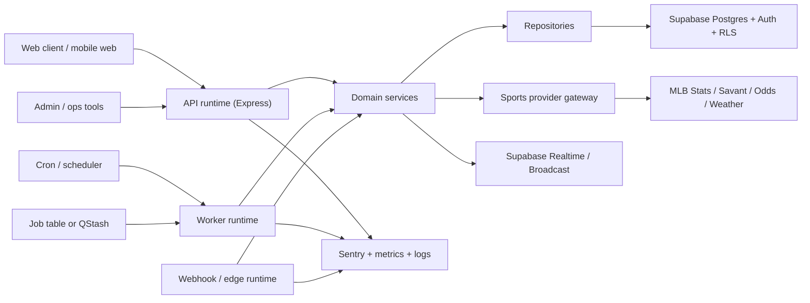

# Vouchres backend architecture v2

## Goal

Design a backend architecture for Vouchres that is honest, durable, and easier
to scale without turning the product into an over-engineered microservice mess.

This proposal is based on the current repo at
`/Users/boydsantos/Desktop/Projects/Vouch/vouchres` as inspected on July 20,
2026, plus current official docs for Supabase, Vercel, Upstash, Sentry,
PostgreSQL, and the OpenAPI tooling already present in the repo.

## Executive summary

The right move is **not** microservices.

The right move is a **modular monolith with split runtimes**:

1. `api` runtime for synchronous user-facing HTTP.
2. `worker` runtime for grading, ingest refresh, reports, and repair jobs.
3. `edge/webhook` runtime only where platform shape really helps, such as Stripe
   webhook isolation or tiny edge-safe callbacks.

Keep one codebase, one schema source, one database, one OpenAPI contract, and
clear domain modules. Split **runtime responsibility**, not ownership of the
entire business.

## What exists today

The current backend is already substantial:

- `38` route files
- `139` service files
- `11` middleware files
- `11` agent files
- only `2` repository files

That imbalance is the main signal. The codebase has many services and routes,
but very little persistence or domain boundary discipline.

Current strengths:

- Honest health and readiness endpoints already exist.
- There is already a provider registry for sports data.
- OpenAPI generation already exists through Zod and `@asteasolutions/zod-to-openapi`.
- Supabase is already the primary persistence layer.
- Upstash, Sentry, Stripe, cron, and typed validators are already wired in.

Current problems:

- `server.ts` still carries too many concerns in one process.
- Route registration is flat and crowded.
- Too many services talk to Supabase directly.
- Async work is mixed into the same runtime that serves user traffic.
- The sports, parlay, trust, AI, social, and billing domains are mixed at the
  composition layer.
- The repo has both modern persistence paths and legacy compatibility paths.

## Current architecture diagnosis

### 1. Runtime mixing

Today one Node process is responsible for:

- Express API
- Vite dev hosting
- Stripe raw-body handling
- cron boot concerns
- sports upstream fetches
- grading
- trust and proof workflows
- AI endpoints
- world chat boot notices
- process safety and shutdown handling

That is too much responsibility for one runtime, even if it stays one repo.

### 2. Domain sprawl

The business domains are real and should be treated as first-class modules:

- identity and profiles
- billing and entitlements
- sports ingest
- HR intelligence
- picks and parlays
- grading and settlement
- trust and proof
- social feed and notifications
- AI generation and judges

Right now they mostly coexist by folder naming, not by hard architectural
boundaries.

### 3. Weak repository layer

The codebase has only a tiny repository layer compared with its service count.
That usually means route handlers and services are free to reach into Supabase
directly, which makes transaction safety, auditing, and refactors harder.

### 4. Async durability gap

The grading service is thoughtful and includes in-process coalescing plus a
distributed lock, but it is still ultimately web-process shaped. Durable async
work should survive deploys, retries, transient upstream failure, and parallel
instances more cleanly than a request-oriented server naturally does.

## Architecture decision

Adopt a **domain-organized modular monolith** with **three deployable
runtimes** and **Postgres-centered transactional rules**.

### Why this wins

- Lowest migration risk from the current repo.
- Preserves current product velocity.
- Improves operational safety without the cost of true microservices.
- Fits Supabase very well.
- Fits your current Vercel, Upstash, and Sentry stack.
- Keeps local development sane.

## Target architecture



## Runtime split

### 1. API runtime

Own only synchronous user-facing work:

- auth-bound API requests
- reads and writes for picks, profiles, posts, notifications
- share and proof reads
- OpenAPI docs
- lightweight orchestration only

Should not own:

- heavy grading loops
- large refresh jobs
- long backfills
- retry-heavy repair flows

### 2. Worker runtime

Own all durable background work:

- grade pending picks
- grade or reconcile parlays
- refresh leaderboards and derived trust views
- run repair scripts
- build daily AI or sports summaries
- ingest-heavy polling and cache warming

This is the biggest missing piece in the current architecture.

### 3. Edge or webhook runtime

Use only for very specific cases where the platform shape helps:

- Stripe webhooks if you want them isolated from the main app
- tiny signed callbacks
- short auth or verification hooks

Do not move core business logic here just because edge sounds modern.

## Domain module layout

Proposed server layout:

```text
server/
  api/
    app.ts
    bootstrap.ts
    routes/
  worker/
    worker.ts
    jobs/
  webhooks/
    stripeWebhook.ts
  modules/
    identity/
      routes.ts
      service.ts
      repository.ts
      schemas.ts
    billing/
    sports/
    hr/
    picks/
    parlays/
    grading/
    trust/
    social/
    notifications/
    ai/
  platform/
    auth/
    cache/
    config/
    logging/
    observability/
    queue/
    db/
```

The rule is simple:

- routes parse and authorize
- services enforce business behavior
- repositories talk to Supabase or Postgres
- gateways talk to external providers
- platform code handles shared infrastructure

## Request path design

The standard path should be:

`route -> schema -> auth/entitlements -> service -> repository/gateway -> response mapper`

Ban these shortcuts in new code:

- route -> Supabase directly
- route -> external provider directly
- service -> random service -> random service chains without ownership

## Database strategy

Supabase Postgres should stay the system of record.

Use it more intentionally:

- Postgres tables remain canonical for picks, legs, grades, profiles, follows,
  posts, subscriptions, trust ledgers, and derived read models.
- Row Level Security remains the defense-in-depth layer for client-accessible
  tables.
- Use database functions or RPC for multi-step transactional writes.
- Use triggers only for narrow, mechanical invariants or event emission, not
  giant hidden business workflows.

### What should move into database functions

Good candidates:

- create parlay with legs
- settle parlay parent and legs atomically
- create proof + share lock transitions
- update subscription entitlement snapshots
- write grading ledger + trust rollup together

This fits both PostgreSQL transaction guidance and Supabase’s guidance that
database functions are good for multi-step business rules and performance-
sensitive logic.

### What should stay in application services

- upstream API calls
- provider fallback logic
- score calculations that depend on external payload normalization
- AI prompting and response handling
- composition of multiple domain reads

## Sports data architecture

Keep the existing gateway direction and harden it.

Target shape:

- `sports` module owns all provider definitions and fetch policy.
- provider-specific clients stay internal to that module.
- other modules consume normalized read models, not raw upstream payloads.

Recommended read-model split:

- `game_schedule_view`
- `lineup_snapshot_view`
- `player_truth_snapshot_view`
- `parlay_live_progress_view`
- `trust_score_view`

This keeps HR and parlay logic from repeatedly rebuilding the same shapes at
request time.

## Async and job architecture

### Phase 1 default

Start with a **Postgres-backed job table plus worker runtime**.

Why:

- you already trust Postgres and Supabase
- easiest migration from current scripts and cron jobs
- simplest local debugging
- good enough for most Vouchres workloads right now

Suggested job classes:

- `grade_pending_picks`
- `refresh_hr_board`
- `reconcile_billing`
- `generate_daily_report`
- `repair_legacy_identity`
- `rebuild_trust_rollups`

### Phase 2 if retry pain grows

Add **Upstash QStash or Workflow** only for jobs that benefit from:

- delayed delivery
- retries across deploys
- dead-letter queues
- external callback durability

This is a real option because QStash supports delay, retry, and DLQ behavior.
But I would not make it a day-one dependency for everything.

## Realtime architecture

Use Supabase Realtime more deliberately.

Best fit:

- grade completion notifications
- live parlay progress fanout
- world chat
- follower or feed freshness nudges

Do not use Realtime as your primary write path.
Use it as a projection or notification channel from canonical writes.

## Auth and security architecture

Keep Supabase Auth.

Improve the server boundary:

- centralize auth client construction
- keep service-role access inside repositories and narrow platform helpers
- do not let feature services instantiate privileged clients ad hoc
- tighten RLS reviews for any table directly exposed to the browser

Important note:

Supabase has a newer `@supabase/server` package in public beta as of May 6,
2026. It may reduce server-side auth boilerplate later, but I would not make a
beta package the first migration priority for Vouchres. The higher-value move is
cleaning boundaries first.

## API contract architecture

You already have a real advantage here:

- Zod schemas
- `@asteasolutions/zod-to-openapi`
- generated OpenAPI

Lean into it harder.

Target:

- every module owns its request and response schemas
- the module registers its own OpenAPI routes and schemas
- generated OpenAPI becomes the stable contract layer
- frontend clients should derive types from the spec or shared schemas instead
  of hand-rolled drift

This is one of the cheapest high-leverage improvements available.

## Observability architecture

Keep Sentry, logs, and health checks.

Add stronger module ownership:

- every request gets request ID and route timing
- every background job gets job ID, run ID, and domain tag
- external provider failures are tagged by provider and capability
- grading writes include settlement path and idempotency metadata

Minimum observability dimensions:

- `domain`
- `operation`
- `provider`
- `user_id` when safe
- `pick_id` or `parlay_id` when relevant
- `request_id`
- `job_id`

## Deployment architecture

### If staying on Vercel

Be aware of the platform shape:

- Node.js functions should run near your data source.
- Functions have bundle limits.
- Hobby cron is limited to once per day.
- Vercel now supports up to 100 cron jobs per project.
- Pro and Enterprise can run functions up to 30 minutes.

That means:

- keep the API runtime small
- do not stuff all background work into one serverless route
- use cron only for bounded scheduled triggers
- move longer jobs to the worker runtime

### If using Render or another always-on Node host

The worker story gets simpler. A small always-on worker process may be a better
fit for grading and ingest loops than pure serverless orchestration.

## Recommended tools from what you already own

### Already in the repo and worth leaning on

- `@asteasolutions/zod-to-openapi` for contract-first API boundaries
- Supabase for Postgres, Auth, RLS, and Realtime
- Upstash Redis for cache, lock, and rate-limit support
- Sentry for Express and worker observability
- existing verification scripts in `scripts/`

### Already in your local tool library and worth studying

From `/Users/boydsantos/Desktop/agent-oss-library`:

- `18-infra-sandbox/supabase`
  for Supabase production patterns
- `09-websites-saas-apps/open-saas`
  for SaaS module and auth/billing layout ideas
- `07-prompt-eval-tools/promptfoo`
  for AI regression checks
- `07-prompt-eval-tools/langfuse`
  if Vouchres AI prompts become a core money path
- `13-modern-agent-sdks/mastra` and `13-modern-agent-sdks/pydantic-ai`
  only if the AI orchestration layer becomes complex enough to justify it

### Tools I would not force right now

- Kubernetes
- multiple independent microservices
- event bus platforms
- vector databases
- separate auth provider
- a full workflow engine for everything

## Recommended migration phases

## Phase 1: untangle the runtime

- create separate entrypoints for `api`, `worker`, and optional `webhook`
- keep one repo and shared modules
- move grading and repair jobs out of the web runtime

## Phase 2: enforce module boundaries

- introduce repository files for each major domain
- stop direct Supabase calls from routes
- move schemas beside module routes and services

## Phase 3: push transactional writes downward

- move atomic parlay creation and settlement flows into database functions
- tighten idempotency for webhook and grading paths

## Phase 4: stabilize contracts and projections

- make OpenAPI the source of truth for public and internal API contracts
- add read models for HR board, live progress, and trust views

## Phase 5: harden async durability

- start with Postgres job table + worker
- add QStash only where retry, delay, or DLQ value is proven

## Concrete first implementation moves

If we were starting this refactor now, I would do these first:

1. Add `server/api/bootstrap.ts`, `server/worker/worker.ts`, and `server/modules/`.
2. Move route registration into module-local route files.
3. Add repositories for `identity`, `billing`, `picks`, `parlays`, `trust`, and `social`.
4. Move grading cron logic to the worker runtime.
5. Define a `job_runs` or `backend_jobs` table for durable work tracking.
6. Move atomic parlay settlement into Postgres RPC or transaction-bound repository methods.
7. Reduce `server/routes/index.ts` to a module composition file instead of a route dump.

## Architecture verdict

Vouchres does not need a brand-new backend stack.

It needs:

- stronger boundaries
- fewer runtime responsibilities per process
- better transaction ownership
- durable background execution
- more intentional use of Supabase and OpenAPI

That is the honest path to a backend that feels like a product, not a pile of
capabilities.

## How to use this document

Use this as the target-state reference before refactoring.

If you approve this direction, the next practical step is to turn it into an
implementation plan with:

- new folder structure
- module ownership map
- first migration PR sequence
- exact files to create or move
- verification commands for each phase
